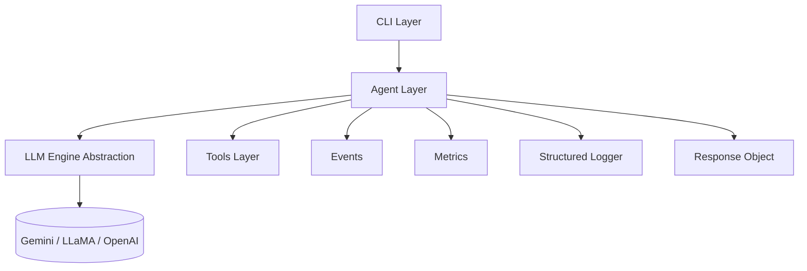
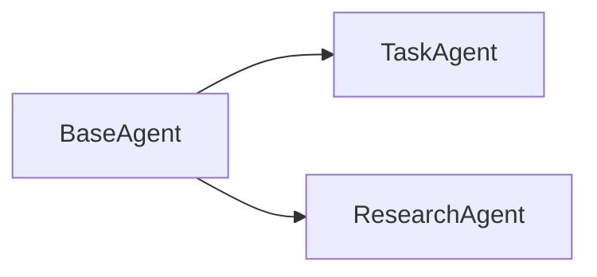
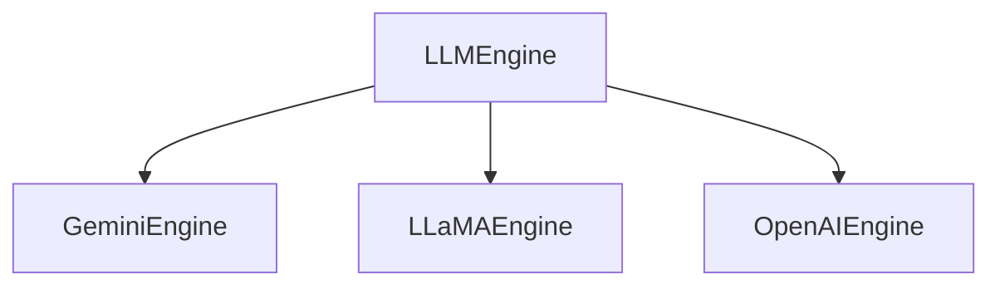
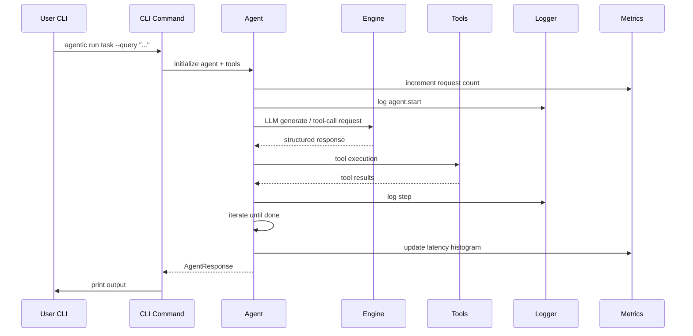
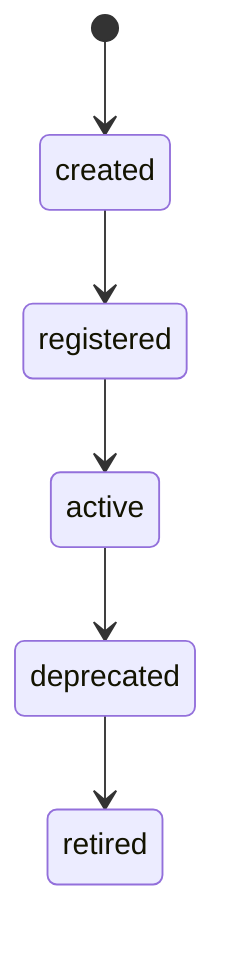
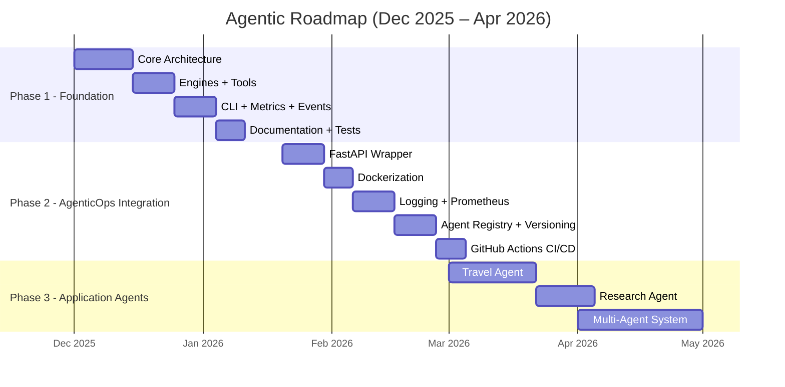

# Agentic Library Architecture & AgenticOps Addendum (v1.0)


## 1. Overview

This document describes the full architecture of the **Agentic Library**, a modular, model-agnostic agent framework designed for local CLI execution, future MLOps integration, and later expansion into Travel Agent, Research Agent, and Multi-Agent Systems.

It also includes the **AgenticOps Addendum**, describing how agents are registered, versioned, monitored, governed, and managed through their lifecycle.

---


# 2. System Goals


### Primary Goals
- Build a lightweight, **framework-free** agent system.
- Support **multiple LLM providers** (Gemini, LLaMA, OpenAI).
- Provide **clean abstractions** for agents, tools, engines, events, and responses.
- Deliver a **CLI-first** interface.
- Include **observability hooks**: logs, metrics, events.
- Provide a foundation for Phase 3 applications:
  - Travel Agent
  - AI Research Agent
  - Multi-Agent System


### Non-Goals
- No LangChain, LlamaIndex, Haystack, DSPy, or MCP integrations.
- No vector DBs or RAG in v1.
- No GUI.
- No cloud requirements.
- No complex orchestration dependencies.

---


# 3. High-Level Architecture



**Key properties:**
- Fully modular.
- No engine or tool hard-coding inside agents.
- Configurable via `settings.py`.
- Designed for future-migration to FastAPI + Docker.

---


# 4. Folder Structure

```text
agentic_lib/
  core/
    agent.py
    llm_engine.py
    response.py
    events.py
  engines/
    gemini_engine.py
    llama_engine.py
    openai_engine.py
  tools/
    base_tool.py
    search.py
    calculator.py
    file_ops.py
    http_post.py
  utils/
    logger.py
    metrics.py
    error_handler.py
    json_parser.py
  config/
    settings.py
    loaders.py
  cli/
    __main__.py
    run_agent.py
    list_tools.py
  examples/
    run_task_agent.py
    run_research_agent.py
  tests/
    test_engines.py
    test_tools.py
    test_agents.py
  README.md
  ARCHITECTURE.md
```

---


# 5. Core Components


## 5.1 Agent Layer


### BaseAgent Responsibilities
- Manage steps and iterations.
- Coordinate LLM calls.
- Interpret tool-call responses.
- Invoke tools and collect results.
- Emit events (start, tool-call, error, finish).
- Update metrics.
- Produce a structured `AgentResponse`.


### Concrete Agents
- **TaskAgent** — general purpose problem solver.
- **ResearchAgent** — search + multi-step summarization.



---


## 5.2 LLM Engine Layer


### Engine Interface
```python
class LLMEngine:
    def generate(self, prompt): ...
    def call_tools(self, prompt, tools): ...
```


### Supported Engines
- GeminiEngine (default, free)
- LLaMAEngine (OpenRouter, free)
- OpenAIEngine (future upgrade)



---


## 5.3 Tools Layer


### BaseTool Interface
```python
class BaseTool:
    name: str
    input_schema: dict
    output_schema: dict
    def execute(self, **kwargs): ...
```


### Initial Tools
- SearchTool
- CalculatorTool
- FileTool
- HTTPPostTool

---


## 5.4 Events System
- Emits lifecycle events:  
  `agent.start`, `agent.finish`,  
  `llm.call`, `llm.error`,  
  `tool.call`, `tool.success`, `tool.error`.

Events go to the structured logger for future observability pipelines.

---


## 5.5 Metrics Layer
Prometheus-style counters:

- `agent_requests_total`
- `agent_errors_total`
- `agent_latency_seconds`
- `agent_tool_calls_total`

Used locally in CLI; later exported via FastAPI.

---


## 5.6 Response Object
```python
@dataclass
class AgentResponse:
    output: str
    steps: list
    metadata: dict
```

Structural stability ensures CLI, API, logs, and tests behave consistently.

---


# 6. Configuration Layer


### settings.py
- `LLM_PROVIDER`
- `LOG_LEVEL`
- `TOOLS_ENABLED`
- `ENABLE_METRICS`
- `MAX_STEPS`


### loaders.py
- loads `.env`
- optional YAML support
- resolves env > yaml > defaults

---


# 7. CLI Layer


### Commands
```text
agentic run task --query "..."
agentic run research --topic "..."
agentic tools
agentic agents
```


### Entrypoint
`agentic_lib.cli.__main__`

---


# 8. Execution Flow



---


# 9. AgenticOps Addendum (v1)

AgenticOps = operational discipline for managing agent lifecycle:

- Registration  
- Versioning  
- Governance  
- Observability  
- Deployment  
- Auditing  
- Rollback  


## 9.1 Agent Registry (Phase 2)
```text
registry/
  agents.json
  tools.json
```

Each agent entry contains:
- name
- version
- description
- allowed tools
- provider
- max_steps
- created_at

---


## 9.2 Agent Lifecycle


### States
- `created`
- `registered`
- `active`
- `deprecated`
- `retired`


### Transitions


---


## 9.3 Observability Hooks
- Structured logs
- Metrics (Prometheus)
- Events (for tracing)
- Optional: future distributed tracing

---


## 9.4 Governance Layer


### Per-agent configuration:
```yaml
allowed_tools:
  - search
  - calculator
max_steps: 5
rate_limit: 20/min
```


### Tool permissioning
Tools MUST declare:
- risky operations
- external network access
- write permissions

---


## 9.5 Deployment & Version Control (Phase 2)

Once FastAPI is added:
- each agent becomes a service endpoint
- metrics exposed at `/metrics`
- logs fed to Promtail/Grafana Loki
- Docker image tagging = agent versioning

---


## 9.6 Rollback Strategy

- One version active at a time
- Previous version stored in registry
- Rollback via environment variable switch:

```
ACTIVE_AGENT_VERSION=1.3
```

---


# 10. Phase Roadmap


## Phase 1: Foundation
- Build agent library
- CLI
- Basic tools
- Basic engines
- Logging, metrics, events


## Phase 2: AgenticOps
- Registry
- FastAPI wrapper
- Dockerization
- Metrics endpoint
- Deployment pipeline
- MLOps integration


## Phase 3: Applications
- Travel Agent
- AI Research Agent
- Multi-Agent System

---


# 11. End of Document
This architecture is stable, extensible, and MLOps-ready.  
It forms the blueprint for all future Agentic and multi-agent development through 2025 and beyond.


# 8. Delivery Timeline (Dec 2025 → Apr 2026)

This section provides a realistic, achievable timeline for completing all three phases while maintaining a sustainable daily workload of 25–40 minutes on weekdays and MLOps/Edureka training on weekends.

## 8.1 Summary

```
Dec 2025 – Jan 2026: Phase 1 – Framework (3–4 weeks)
Jan – Feb 2026: Phase 2 – AgenticOps (4–6 weeks)
Feb – Apr 2026: Phase 3 – Applications (6–8 weeks)
```

---

## 8.2 Gantt Chart (Mermaid)



---

## 8.3 Month-by-Month Roadmap

### **December 2025 – Phase 1 begins**
- BaseAgent + engine abstraction  
- Gemini + LLaMA engines  
- JSON parser  
- Initial tools  
- Events + logger foundation  
- Weekends = Edureka MLOps

### **January 2026 – Phase 1 completion + Phase 2 start**
- Finishing CLI, metrics, error handler  
- Documentation  
- Begin FastAPI + Docker  
- Weekends = Edureka (ending)

### **February 2026 – Phase 2 full execution**
- FastAPI  
- Dockerization  
- Structured logs  
- Prometheus endpoint  
- Agent Registry  
- Governance  
- CI/CD integration  

### **March 2026 – Phase 3 Applications**
- Travel Agent  
- AI Research Agent  

### **April 2026 – Phase 3 Finalization**
- Multi-Agent System  
- Polishing  
- GitHub publishing  
- Video demo (optional)

---

# End of Document
